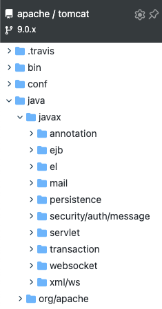
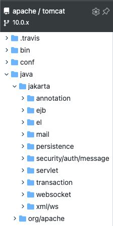
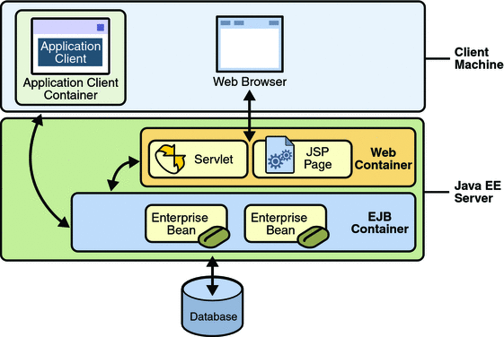
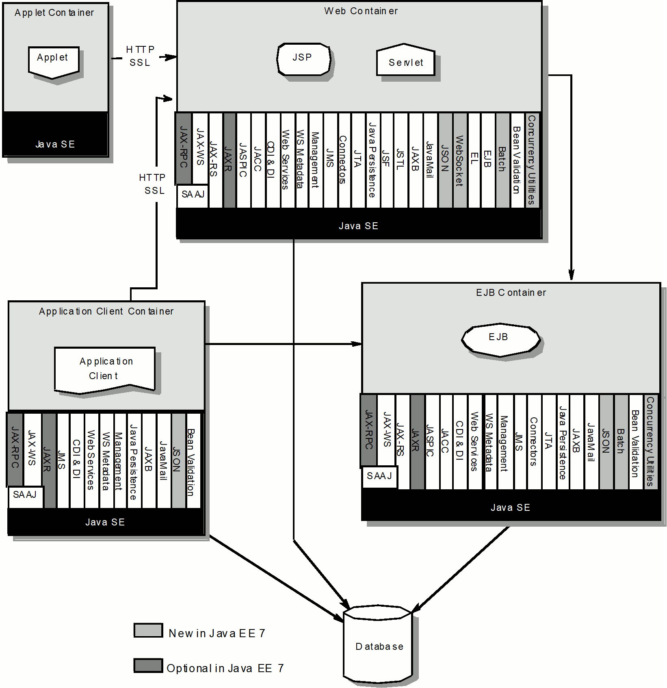
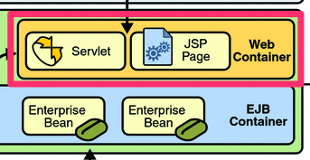
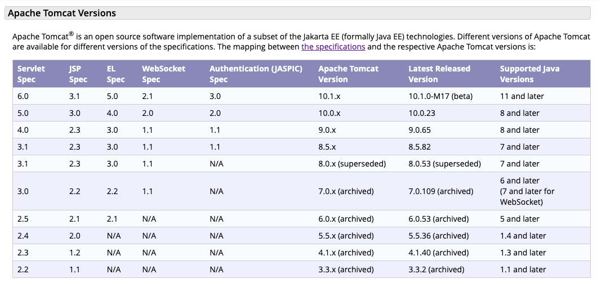

현재 우아한테크코스에서는 `Tomcat 구현하기` 미션을 진행하고 있다. 지금까지 `Spring Boot`를 활용하여 기본적으로 적용되던 `Tomcat`이었지만 어떠한 목적으로 등장 했으며, 무엇을 제공해주는지 알지 못한채 웹 애플리케이션 개발을 위해서만 사용하곤 했다. 직접 Tomcat을 만들어가는 미션을 시작한 만큼 이번 기회를 통해 `Tomcat`에 대해 간단히 정리해보려 한다.

> 해당 게시글은 Tomcat 9.x.x 버전을 기준으로 작성 되었습니다.

## Tomcat 이란?

`Tomcat`은 `Server`이다. `Server`란 사전적 의미로 네트워크에서 다른 컴퓨터 및 소프트웨어와 같은 클라이언트에게 `서비스`를 `제공`하는 주체이다. 그렇다면 `Tomcat`은 클라이언트에게 어떤 것을 `제공`해주기 위한 `Server`일까?

## Java Enterprise Edition (Java EE)

`Java`로 분산 애플리케이션 개발을 목적으로 만들었다. Enterprise 애플리케이션을 개발 및 실행 하기 위한 기술과 환경을 제공하며 Servlet, JSP, EJB, JDBC 등 `Server`를 개발하기 위해 필요한 기술들의 `스펙`을 모아둔 것이다. 

이러한 명세가 모여 하나의 Java EE가 정의되면 해당 명세를 기반으로 구현한 것을 `WAS (Web Application Server)`라 부른다. 대표적으로 GlassFish, JBoss와 같은 제품들이 존재한다.

이 밖에도 모바일 환경에 필요한 컴포넌트를 모아둔 `Java Micro Edition`, 표준 환경(Desktop Application)에서 제공하기 위한 `Standard Edition`이 있다.

> 이클립스 재단으로 이관된 Java EE의 공식 명칭은 Jakarta EE로 변경 되었다. 자세한 내용은 [Java EE에서 Jakarta EE로의 전환](https://www.samsungsds.com/kr/insights/java_jakarta.html)에서 확인해볼 수 있다.

Tomcat 9.x.x 까지는 `Java EE`의 명세를 따라간다. Tomcat 10.x.x 버전 이후 부터 `Jakarta EE`를 기반으로 진행되고 있다. 실제 [Tomcat github](https://github.com/apache/tomcat)에 들어가보면 아래와 같이 구성되어 있는 것을 확인할 수 있다.

**Tomcat 9.0.x**

 
**Tomcat 10.0.x**

## Java EE 서버의 Container

위 그림은 클라이언트와 Java EE 서버가 통신하는 구조를 보여 준다. `Web Contatiner`는 웹 브라우저에서 HTTP를 통해 들어온 요청에 대한 처리를 담당한다. `EJB Contatiner`는 `Web Contatiner` 혹은 직접적인 통신으로 들어온 요청에 대한 `비즈니스 로직`을 수행한다. 

단순한 `Application 클라이언트`의 경우 HTTP가 아닌 다른 방식을 활용하여 Java EE 서버의 `EJB Container`를 통해 비즈니스 로직을 수행할 수 있다. 하지만 `웹 브라우저 클라이언트`의 경우엔 다르다. 오직 HTTP 통신을 위한 `Web Container`를 거쳐야만 `EJB Container`의 비즈니스 로직을 수행할 수 있다.

이러한 `Container`에는 `Servlet`, `JSP`와 같은 다양한 컴포넌트로 구성되어 있다. 이러한 Java EE의 서버 내부는 컴포넌트를 묶은 `Container`로 구분할 수 있다.

아래는 Java EE 7의 Architecture Diagram이다.

> 각 Container의 컴포넌트가 궁금하다면 Java EE Architecture diagram, Jakarta Architecture diagram와 같은 키워드로 검색 시 확인할 수 있다. [Architecture](https://jakarta.ee/specifications/platform/8/platform-spec-8.html#architecture)

## Web Container

그렇다면 도대체 `Java EE`와 `Tomcat`은 어떤 관련이 있는 걸까? 앞서 언급한 것처럼 Java EE 스펙을 구현한 것을 `WAS`라고 부른다. 대부분 Tomcat을 검색 해보면 대표적인 `WAS`로 소개되곤 한다.

사실 `Tomcat`은 온전한 `WAS`라고 볼 수 없다. `Tomcat`은 오로지 `Java EE Container` 중 `Web Container`만을 구현하였기 때문이다.

그렇기 때문에 `Web Container`을 구현한 `Tomcat`은 `HTTP` 통신에 대한 요청만 처리할 수 있다.

# Tomcat Version

아래는 `Tomcat`의 버전 별 `Web Container`에 속한 `컴포넌트의 명세 버전`을 가져온 것이다.

`Tomcat 9.0.x`의 경우 `Servlet 4.0`, `JSP 2.3`, `WebSocket 1.1` 등을 지원하고 있는 것을 확인할 수 있다. 또한 `Java 8` 이후를 사용해야 동작 가능 하다.

# 정리

지금까지 `Tomcat`과 `Java EE`에 대해 간단히 알아보았다. 우리가 지금까지 알고 있던 `WAS`와는 다르게 `Tomcat`은 오직 `Java EE`의 `Web Container`만을 구현하고 있다. 

다시 한번 질문에 대한 답변을 정리해보려 한다. `Tomcat`은 클라이언트에게 어떤 것을 `제공`해주기 위한 `Server`일까? `Tomcat`은 `Web Container` 스펙의 `구현`이며, `HTTP`에 대한 요청을 처리할 수 있는 `Server`이다.

## References.

[Java EE에서 Jakarta EE로의 전환](https://www.samsungsds.com/kr/insights/java_jakarta.html) 
[Java EE Clients](https://docs.oracle.com/cd/E19575-01/819-3669/bnabc/index.html) 
[Architecture](https://jakarta.ee/specifications/platform/8/platform-spec-8.html#architecture) 
[Apache Tomcat Versions](https://tomcat.apache.org/whichversion.html)
