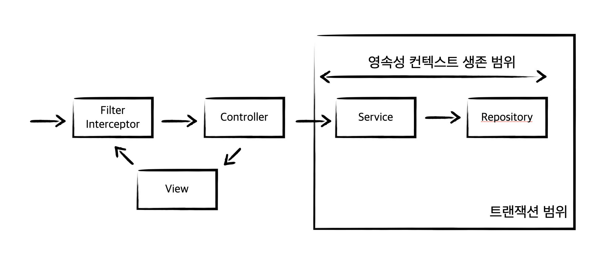
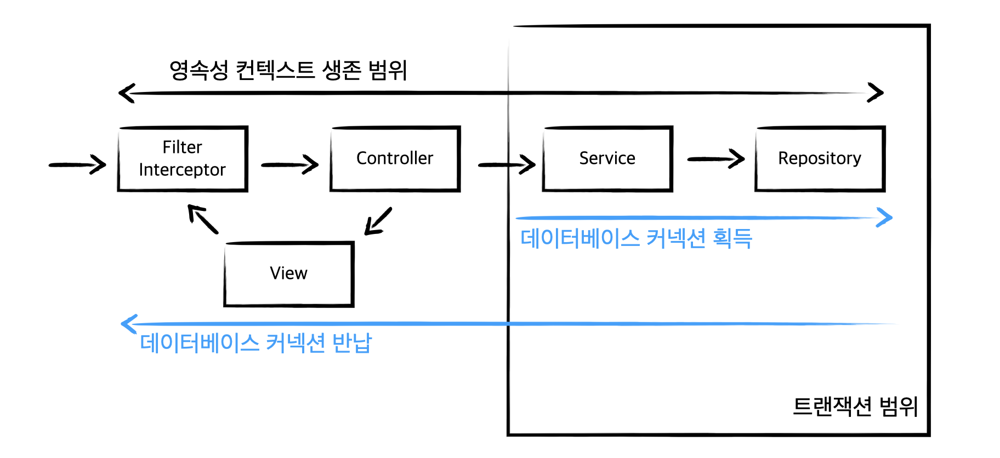
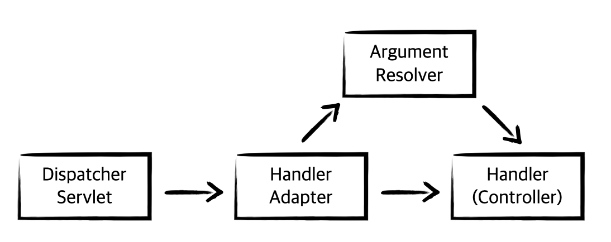
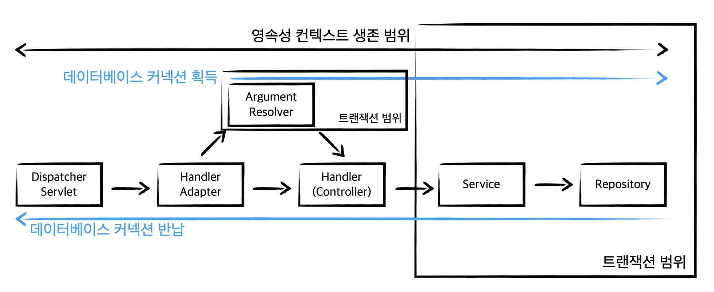

## OSIV

OSIV는 Open Session In View의 준말로, 영속성 컨텍스트를 뷰까지 열어둔다는 것을 의미이다. 영속성 컨텍스트가 유지된다는 의미는 뷰에서도 `Lazy Loading`과 같이 영속성 컨텍스트의 이점을 누릴 수 있다는 것이다.

## 요청 당 트랜잭션

OSIV의 핵심은 뷰에서도 `Lazy Loading`이 가능하도록 하는 것이다. 가장 단순한 방법은 요청이 들어오자 마자 `Filter` 혹은 `Interceptor`를 거치는 시점에 `트랜잭션을 시작`하고 요청이 끝날 때 `트랜잭션을 종료`하는 것이다. 이것을 `요청 당 트랜잭션 방식`의 `OSIV`라 하며 초창기에 사용되던 방식이다. 이것을 그림으로 표현하면 아래와 같다.


그림을 살펴보면 요청부터 응답까지 영속성 컨텍스트의 생존 범위가 늘어나게 된다. 이제 뷰에서도 `Lazy Loading`을 진행할 수 있지만 몇 가지 단점을 가지고 있다. 

먼저 뷰에서도 엔티티의 수정이 가능해진다. 영속성 컨텍스트의 범위가 늘어나기 때문에 뷰에서 엔티티의 수정이 일어나면 `Dirty Checking` 과정을 통해 응답 시점에, 즉 트랜잭션이 끝나는 시점에 데이터베이스에 반영된다.

뷰에서 데이터를 수정하는 것의 가장 큰 문제는 데이터의 변경 지점을 찾기 어렵게 만든다는 것이다. 비즈니스 로직이 담긴 서비스 계층에서 데이터를 수정한 뒤 영속하는 것은 당연한 것 처럼 받아들일 수 있다. 보통 서비스 계층에서 로직을 시작할 때 `@Transactional` 애노테이션을 통해 선언적 트랜잭션을 명시한 후 비즈니스 로직을 수행한다. 하지만 뷰에서의 엔티티 속성 변경으로 데이터베이스에 영속되는 것은 우리가 뷰에게 원하는 방향은 아니다.

또한 데이터베이스 관련 로직이 필요하지 않은 부분에도 `불필요하게 데이터베이스 커넥션이 활용`될 수 있다. 요청 당 트랜잭션은 요청과 동시에 데이터베이스 커넥션을 커넥션 풀에서 획득한다. 결국 트랜잭션이 끝나는 응답 시점까지 데이터베이스 커넥션을 물고 있는 것이다. 해당 로직 내에서 데이터베이스와 관련된 로직이 처리되지 않는다면 `불필요한 커넥션 자원을 낭비`하고 있는 것과 다름 없다.

## 비즈니스 계층 트랜잭션

요청과 동시에 트랜잭션을 획득하는 요청 당 트랜잭션은 많은 단점을 가지고 있다. 스프링에서는 이러한 단점을 개선하기 위해 비즈니스 계층 트랜잭션을 제공하고 있다.

### OpenSessionInViewFilter

```java
package org.springframework.orm.hibernate5.support;
...
public class OpenSessionInViewFilter extends OncePerRequestFilter {
    ...
}
```

하이버네이트 OSIV 서블릿 필터이다. OpenSessionViewFilter는 필터 내에 Session을 오픈 하지만 트랜잭션은 시작하지 않는다. 트랜잭션을 시작하지 않기 때문에 실제 데이터베이스의 커넥션을 획득하지 않는다. Session은 생성되기 때문에 `영속성 컨텍스트만 생성`된다.

### OpenSessionInViewInterceptor

```java
package org.springframework.orm.hibernate5.support;
...
public class OpenSessionInViewInterceptor implements AsyncWebRequestInterceptor {
    ...
}
```

하이버네이트 OSIV 스프링 인터셉터이다. Filter와 동일하게 Interceptor에서 Session은 오픈 하지만 트랜잭션은 시작하지 않는다.

### OpenEntityManagerInViewFilter

```java
package org.springframework.orm.jpa.support;
...
public class OpenEntityManagerInViewFilter extends OncePerRequestFilter {
    ...
}
```

JPA에서 제공하는 OSIV 서블릿 필터이다.

### OpenEntityManagerInViewInterceptor

```java
package org.springframework.orm.jpa.support;
...
public class OpenEntityManagerInViewInterceptor extends EntityManagerFactoryAccessor implements AsyncWebRequestInterceptor {
    ...
}
```

JPA에서 제공하는 OSIV 스프링 인터셉터이다. 

이제 위 객체들을 필요에 따라 필터 혹은 인터셉터에 등록하여 사용하면 된다. 

스프링 부트는 `application properties` 설정 중 `spring.jpa.open-in-view`을 통해 지정이 가능하다. 

```yaml
spring:
    jpa:
        open-in-view: true
```

아래는 스프링 부트에서 OSIV 관련 설정을 자동으로 해주는 `JpaWebConfiguration`이다. 

```java
@Configuration(proxyBeanMethods = false)
@EnableConfigurationProperties(JpaProperties.class)
public abstract class JpaBaseConfiguration implements BeanFactoryAware {
  ...
  @Configuration(proxyBeanMethods = false)
	@ConditionalOnWebApplication(type = Type.SERVLET)
	@ConditionalOnClass(WebMvcConfigurer.class)
	@ConditionalOnMissingBean({ OpenEntityManagerInViewInterceptor.class, OpenEntityManagerInViewFilter.class })
	@ConditionalOnMissingFilterBean(OpenEntityManagerInViewFilter.class)
	@ConditionalOnProperty(prefix = "spring.jpa", name = "open-in-view", havingValue = "true", matchIfMissing = true)
	protected static class JpaWebConfiguration {

		private static final Log logger = LogFactory.getLog(JpaWebConfiguration.class);

		private final JpaProperties jpaProperties;

		protected JpaWebConfiguration(JpaProperties jpaProperties) {
			this.jpaProperties = jpaProperties;
		}

		@Bean
		public OpenEntityManagerInViewInterceptor openEntityManagerInViewInterceptor() {
			if (this.jpaProperties.getOpenInView() == null) {
				logger.warn("spring.jpa.open-in-view is enabled by default. "
						+ "Therefore, database queries may be performed during view "
						+ "rendering. Explicitly configure spring.jpa.open-in-view to disable this warning");
			}
			return new OpenEntityManagerInViewInterceptor();
		}

		@Bean
		public WebMvcConfigurer openEntityManagerInViewInterceptorConfigurer(
				OpenEntityManagerInViewInterceptor interceptor) {
			return new WebMvcConfigurer() {

				@Override
				public void addInterceptors(InterceptorRegistry registry) {
					registry.addWebRequestInterceptor(interceptor);
				}
			};
		}
	}
}
```

- `ConditionalOnProperty`: Property의 조건에 따라 작동하는 `Bean`이다. application.yml에 있는 값을 기준으로 Bean을 생성한다.

간단히 코드를 살펴보면 `OpenEntityManagerInViewInterceptor`를 빈으로 등록하는 것을 확인할 수 있다. 자세한 동작 과정은 추후 살펴보려한다.

무튼 스프링에서 제공하는 OSIV를 사용하면 트랜잭션의 범위를 비즈니스 계층으로 좁힐 수 있다. 그림으로 표현하면 아래와 같다.



요청이 들어오면 OSIV 설정 정보에 따라 필터 혹은 인터셉터에서 `영속성 컨텍스트`를 생성한다. 여기서 중요한 것은 트랜잭션을 시작하지 않는다는 것이다. 

그렇다면 트랜잭션은 언제 시작할까? 바로 서비스 계층에서 `@Transactional`을 마주할 때 미리 생성한 영속성 컨텍스트를 기반으로 시작한다.

그 다음 서비스 계층에서 모든 트랜잭션이 마무리되면 트랜잭션을 커밋한다. 단 `영속성 컨텍스트`는 지속된다. 영속성 컨텍스트는 OSIV로 지정한 범위까지 유지된다. 이때 영속성 컨텍스트를 종료하지만 `flush()`는 호출되지 않는다.

정리하면 아래와 같다.

- 영속성 컨텍스트가 트랜잭션 범위 내에 있으면 엔티티를 `조회`하고 `수정`할 수 있다.
- 영속성 컨텍스트가 트랜잭션 범위 밖에 위치하면 엔티티 `조회`만 가능하다. 즉 `Lazy Loading`이 가능하다는 것을 의미한다.

## OSIV를 사용하며 직면한 문제

`@Transational` 애노테이션을 사용할 때 `영속성 컨텍스트`를 가져와 트랜잭션 처리를 위해 `데이터베이스 커넥션을 획득`한다. 

OSIV는 트랜잭션이 끝나도 영속성 컨텍스트를 유지하고 있다. 즉 트랜잭션 범위 외에도 `엔티티 조회`가 가능하다. 이것이 의미하는 바는 데이터베이스 커넥션을 계속 붙들고 있다는 것을 의미한다. 그림으로 표현하면 아래와 같다.



OSIV는 뷰에서 영속성 컨텍스트를 유연하게 활용할 수 있어서 다양한 이점을 누릴 수 있다. 다만 `Interceptor`이후 동작하는 `ArgumentResolver`에서 트랜잭션을 활용할 경우 성능 상에 문제가 발생할 수 있다.

아래는 Spring MVC를 간소화한 그림이다.



`ArgumentResolver`를 등록하면 핸들러로 들어온 데이터를 추가 가공하는 등의 `전처리 작업`을 진행할 수 있다. 보통 회원의 존재 여부와 같이 인증이 필요한 부분에 공통적으로 활용할 수 있는데, 이때 회원이 존재하는지 확인하기 위해 `데이터베이스`를 필요로 하는 경우 문제가 발생할 수 있다.

가령 아래와 같은 `ArgumentResolver`가 있다고 가정한다.

```java
@Component
public class AuthenticationPrincipalArgumentResolver implements HandlerMethodArgumentResolver {

    private final AuthService authService;

    public AuthenticationPrincipalArgumentResolver(final AuthService authService) {
        this.authService = authService;
    }

    @Override
    public boolean supportsParameter(final MethodParameter parameter) {
        return parameter.hasParameterAnnotation(AuthenticationPrincipal.class);
    }

    @Override
    public Object resolveArgument(final MethodParameter parameter, final ModelAndViewContainer mavContainer,
                                  final NativeWebRequest webRequest, final WebDataBinderFactory binderFactory) {
        HttpServletRequest request = webRequest.getNativeRequest(HttpServletRequest.class);
        String accessToken = AuthorizationExtractor.extract(request);
        Long id = authService.extractMemberId(accessToken);
        return new LoginMember(id);
    }
}
```

`@AuthenticationPrincipal` 애노테이션이 붙은 매개변수를 채우기 이전에 `authService.extractMemberId(accessToken)`을  통해 회원의 정보를 추출하고 있다. 해당 메서드 내부에서는 데이터베이스 트랜잭션을 통해 회원 정보를 조회하고 있다.

```java
@Transactional(readOnly = true)
@Service
public class AuthService {
    ...
    public Long extractMemberId(final String accessToken) {
        Long memberId = tokenCreator.extractPayload(accessToken);
        memberRepository.validateExistsById(memberId);
        return memberId;
    }
}
```

`extractMemberId()` 메서드는 `@Transactional(readOnly = true)`을 통해 읽기 전용으로 트랜잭션을 활용하고 있다.

그렇다면 이러한 상황에서 어떠한 문제가 발생할까? OSIV는 `트랜잭션 시작 시점`에 `데이터베이스 커넥션을 획득`한다. 즉 `ArgumentResolver`에서 회원 검증을 위한 조회 로직을 수행하는 시점에 데이터베이스 커넥션을 획득한다는 것이다. 이것을 다시 한 번 그림으로 살펴보자.



한 번 획득한 `데이터베이스 커넥션`은 OSIV 설정으로 인해 지정 범위까지 유지된다. 즉 트랜잭션 범위 내에서만 데이터베이스 커넥션이 유지되는 것이 아니라 `요청 중 최초`에 지정된 커넥션을 재사용하기 때문에 오랜시간 동안 커넥션 자원을 사용하는 것이다.

보통 데이터베이스와 연결을 위한 커넥션 자원을 비싼 비용을 가지고 있다. 이것을 절약하기 위해 커넥션 풀에 일정 개수의 커넥션을 생성한 뒤 재사용하는 방식을 활용하곤 한다. 결국 커넥션은 `한정된 자원`이다. 오랜시간 커넥션을 물고 있다는 것은 `병목`이 발생할 가능성이 커진다는 것을 의미한다. 다수의 요청이 발생할 경우 커넥션을 획득하지 못한 요청은 `대기`하게 될 것이다. 모든 케이스에 해당하는 것은 아니지만 실시간 트래픽이 중요한 애플리케이션의 경우 커넥션의 개수가 부족하여 장애로 이어질 수 있다.

## 정리

OSIV는 영속성 컨텍스트의 생존 범위를 늘려주어 엔티티 `Lazy Loading`과 같은 다양한 이점을 누릴 수 있다. 스프링을 사용할 경우 OSIV를 비즈니스 계층 트랜잭션으로 활용하여 보다 더 안정적으로 영속성 컨텍스트를 활용할 수 있다.

하지만 이러한 이점을 누리기 위해서는 오랜시간 데이터베이스 커넥션을 활용해야 한다. 실시간 트래픽이 주가 되는 애플리케이션의 경우 한정된 커넥션 개수가 부족하여 장애로 이어질 수 있음을 염두해 두어야 한다.

## References.

[OpenEntityManagerInViewInterceptor](https://docs.spring.io/spring-framework/docs/current/javadoc-api/org/springframework/orm/jpa/support/OpenEntityManagerInViewInterceptor.html)<br/>
김영한 지음, 『자바 ORM 표준 JPA 프로그래밍』, 에이콘(2015), p593-607.
