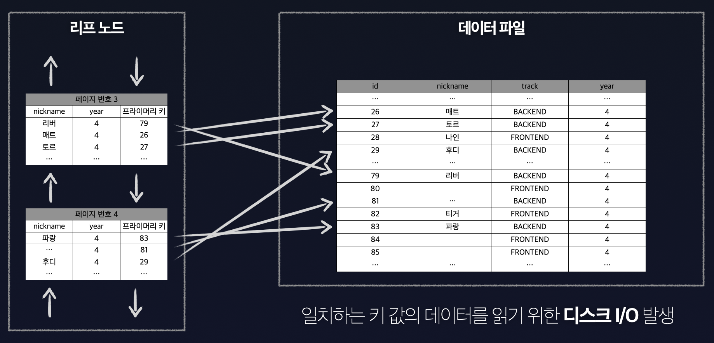
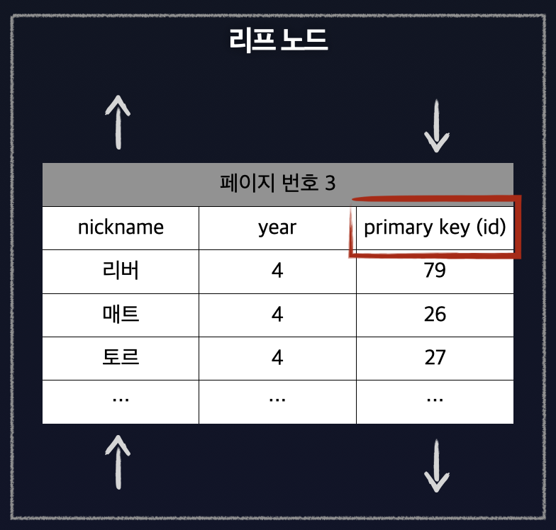

# 커버링 인덱스

> MySQL 8.0 이상, InnoDB 스토리지 엔진을 기준으로 작성되었다.

인덱스를 사용하여 처리하는 쿼리 중 가장 큰 부하를 차지하는 부분은 어디일까? 바로 인덱스 검색에서 일치하는 키 값의 `레코드를 읽는 것`이다.

그림을 살펴보면 인덱스 검색에서 일치하는 키 값을 데이터 파일에서 읽을 때 비교적 느린 속도를 가진 디스크 I/O가 발생한다.



N개의 인덱스 검색 시 최악의 경우 N번의 디스크 I/O가 발생할 수 있다. 

이것을 커버링 인덱스를 활용하여 개선할 수 있다. 커버링 인덱스는 데이터 파일을 읽지 않고 인덱스만 읽어 불필요한 디스크 I/O를 줄일 수 있다.

먼저 간단한 예제를 위한 crew 테이블이다. 데이터는 대략 `100만건`을 기준으로 한다.

```sql
CREATE TABLE crew (
    id INT NOT NULL AUTO_INCREMENT,
    nickname VARCHAR(20) NOT NULL,
    track VARCHAR(20) NOT NULL,
    year INT NOT NULL,
    CONSTRAINT pk_crew_id PRIMARY KEY (id)  
);
```

- `id`: 고유 식별자
- `nickname`: 닉네임
- `track`: 진행 중인 track (e.g. FRONTEND, BACKEND 등)
- `year`: 기수 (e.g. 1기, 2기 등)

## 인덱스 설정

crew 테이블에서 닉네임이 `a ~ d` 사이이며 `BACKEND` 트랙을 진행 중인 크루를 조회한다고 가정한다. 쿼리로 표현하면 아래와 같다.

```sql
SELECT * 
FROM crew 
WHERE nickname BETWEEN 'a' AND 'd' AND track = 'BACKEND';   
```

위 쿼리에 인덱스를 적용하기 위해 `nickname`과 `track`으로 복합 인덱스를 설정한다.

```sql
ALTER TABLE crew ADD INDEX idx_crew_nickname_track (nickname, track);   
```

이제 실행 계획을 살펴보자.

```sql
mysql> EXPLAIN SELECT * FROM crew WHERE nickname BETWEEN 'a' AND 'd' AND track = 'BACKEND';
+----+-------------+-------+------------+------+-------------------------+------+---------+------+--------+----------+-------------+    
| id | select_type | table | partitions | type | possible_keys           | key  | key_len | ref  | rows   | filtered | Extra       |    
+----+-------------+-------+------------+------+-------------------------+------+---------+------+--------+----------+-------------+    
|  1 | SIMPLE      | crew  | NULL       | ALL  | idx_crew_nickname_track | NULL | NULL    | NULL | 997049 |     3.70 | Using where |    
+----+-------------+-------+------------+------+-------------------------+------+---------+------+--------+----------+-------------+    
```

`*`를 활용하여 모든 칼럼을 조회할 경우 옵티마이저는 인덱스를 활용하여 레코드를 읽는 것 보다 데이터 파일을 바로 읽는 것이 더욱 빠르다고 판단하여 `풀 테이블 스캔(ALL)`을 진행한 것을 확인할 수 있다.

> 인덱스를 통해 레코드를 읽는 것 > 데이터 파일을 바로 읽는 것 (비용 측면)
> 

## 커버링 인덱스 활용

이제 `커버링 인덱스` 활용을 위해 모든 칼럼을 조회(`*`)하는 쿼리에서 `nickname`과 `track` 칼럼을 활용하여 조회하는 방식으로 개선한다.

```sql
SELECT nickname, track 
FROM crew 
WHERE nickname BETWEEN 'a' AND 'd' AND track = 'BACKEND';   
```

다시 실행 계획을 살펴보자.

```sql
mysql> EXPLAIN SELECT nickname, track FROM crew WHERE nickname BETWEEN 'a' AND 'd' AND track = 'BACKEND';
+----+-------------+-------+------------+-------+-------------------------+-------------------------+---------+------+--------+----------+--------------------------+   
| id | select_type | table | partitions | type  | possible_keys           | key                     | key_len | ref  | rows   | filtered | Extra                    |   
+----+-------------+-------+------------+-------+-------------------------+-------------------------+---------+------+--------+----------+--------------------------+   
|  1 | SIMPLE      | crew  | NULL       | range | idx_crew_nickname_track | idx_crew_nickname_track | 164     | NULL | 368652 |    10.00 | Using where; Using index |   
+----+-------------+-------+------------+-------+-------------------------+-------------------------+---------+------+--------+----------+--------------------------+   
```

`type`을 살펴보면 `Index Range Scan`이 발생한 것을 볼 수 있다. 또한 추가적으로 확인해야 할 부분이 있는데, `Extra` 칼럼의 `Using index`이다. 커버링 인덱스를 타게 되면 `Extra` 칼럼에 `Using index`가 표시되는 것을 확인할 수 있다.

## 조회  속도 비교

이제 `모든 칼럼을 조회하는 쿼리`와 `커버링 인덱스가 가능한 쿼리`의 조회 속도를 비교해보자. 테이블에는 100만건의 데이터가 있다.

먼저 모든 칼럼의 조회 속도이다.

```sql
SELECT *
FROM crew 
WHERE nickname BETWEEN 'a' AND 'd' AND track = 'BACKEND';   

+----------+---------+
| nickname | track   |
+----------+---------+
| a0002ccc | BACKEND |
| a000319e | BACKEND |
| a00058f1 | BACKEND |
| ...      | ...     |
| cfffd6f4 | BACKEND |
| cfffdb4a | BACKEND |
| cffffbb2 | BACKEND |
+----------+---------+
93617 rows in set (3.04 sec)
```

다음은 커버링 인덱스로 개선한 조회 쿼리이다.

```sql
SELECT nickname, track 
FROM crew 
WHERE nickname BETWEEN 'a' AND 'd' AND track = 'BACKEND';   

+----------+---------+
| nickname | track   |
+----------+---------+
| a0002ccc | BACKEND |
| a000319e | BACKEND |
| a00058f1 | BACKEND |
| ...      | ...     |
| cfffd6f4 | BACKEND |
| cfffdb4a | BACKEND |
| cffffbb2 | BACKEND |
+----------+---------+  
93617 rows in set (0.54 sec)
```

`3.04 sec → 0.54 sec` 로 조회 성능이 개선된 것을 확인할 수 있다. 100만건 보다 많은 데이터가 있다면 보다 더 유의미한 차이가 날 것이라 기대한다.

## 커버링 인덱스의 숨겨진 비밀

커버링 인덱스에는 한 가지 비밀이 더 숨겨져 있다. 만약 `프라이머리 키`인 `id`를 함께 조회하는 이 쿼리는 어떤 인덱스를 탈까?

```sql
SELECT id, nickname, track 
FROM crew 
WHERE nickname BETWEEN 'a' AND 'd' AND track = 'BACKEND';   
```

실행 계획을 살펴보자.

```sql
mysql> EXPLAIN SELECT id, nickname, track FROM crew WHERE nickname BETWEEN 'a' AND 'd' AND track = 'BACKEND';
+----+-------------+-------+------------+-------+-------------------------+-------------------------+---------+------+--------+----------+--------------------------+   
| id | select_type | table | partitions | type  | possible_keys           | key                     | key_len | ref  | rows   | filtered | Extra                    |   
+----+-------------+-------+------------+-------+-------------------------+-------------------------+---------+------+--------+----------+--------------------------+   
|  1 | SIMPLE      | crew  | NULL       | range | idx_crew_nickname_track | idx_crew_nickname_track | 164     | NULL | 368652 |    10.00 | Using where; Using index |   
+----+-------------+-------+------------+-------+-------------------------+-------------------------+---------+------+--------+----------+--------------------------+   
```

앞선 예시와 동일하게 커버링 인덱스를 타는 것을 확인할 수 있다. `프라이머리 키`는 `복합 인덱스`로 설정하지 않았는데 왜 같은 결과가 나올까?

그에 대한 해답은 `InnoDB`의 `세컨더리 인덱스`의 특수한 구조 덕분이다. 세컨더리 인덱스의 리프 노드는 실제 레코드의 주소를 가지고 있는 것이 아닌, 클러스터드 인덱스가 걸린 프라이머리 키를 주소로 가지고 있다.



그렇기 때문에 이 프라이머리 키를 포함한 조회 쿼리도 충분히 커버링 인덱스로 활용이 가능하다.

## References.

백은빈, 이성욱, 『Real MySQL 8.0』, 위키북스(2021), p476 ~ 479

<TagLinks />
