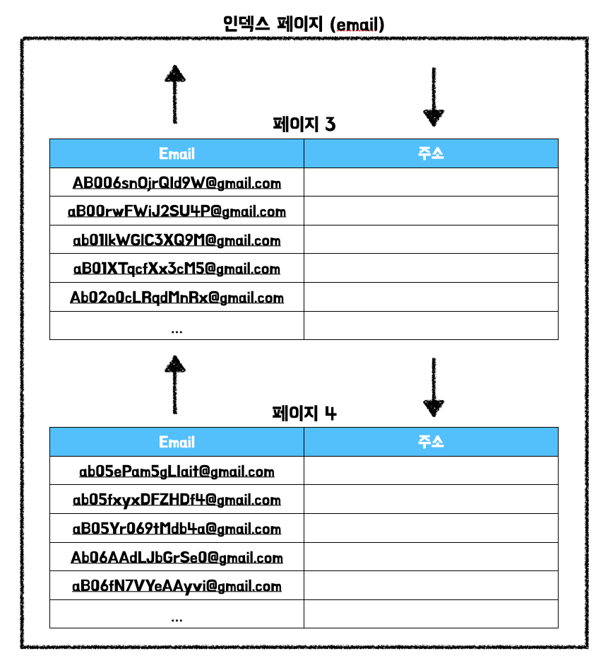
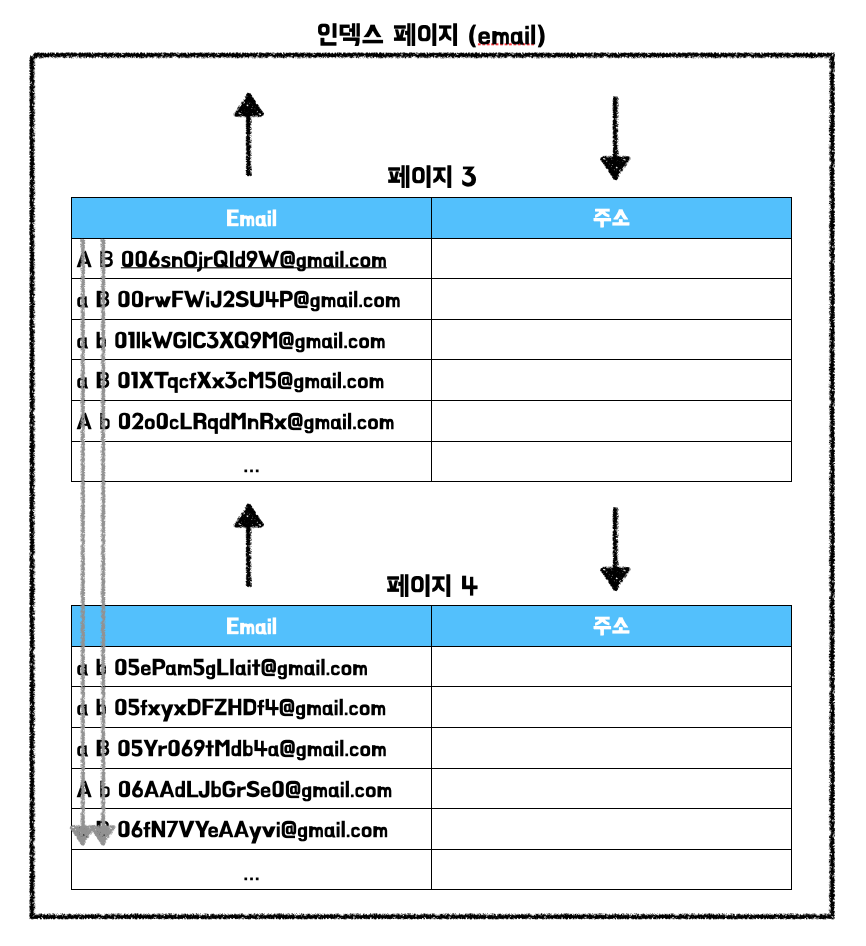

# 특정 LIKE 조건을 인덱스할 수 없는 이유

`B-Tree` 인덱스는 기본적으로 `오름차순 정렬`되기 때문에 왼쪽 값을 기준으로 오른쪽 값이 정렬된다. 이러한 특정으로 인해 특정 `LIKE` 조건을 사용할 때 인덱스를 적용할 수 없다.

- `LIKE ‘%mat’`
- `LIKE ‘_mat’`
- `LIKE ‘%mat%’`

아래와 같은 테이블이 있다고 가정한다.

```sql
mysql> DESC members;
+-------------------+--------------+------+-----+-------------------+-------------------+  
| Field             | Type         | Null | Key | Default           | Extra             |  
+-------------------+--------------+------+-----+-------------------+-------------------+  
| id                | bigint       | NO   | PRI | NULL              | auto_increment    |  
| email             | varchar(255) | NO   | MUL | NULL              |                   |  
| display_name      | varchar(255) | NO   |     | NULL              |                   |  
| profile_image_url | varchar(255) | NO   |     | NULL              |                   |  
| social_type       | varchar(255) | NO   |     | NULL              |                   |  
| created_at        | timestamp    | NO   |     | CURRENT_TIMESTAMP | DEFAULT_GENERATED |  
| updated_at        | timestamp    | NO   |     | CURRENT_TIMESTAMP | DEFAULT_GENERATED |  
+-------------------+--------------+------+-----+-------------------+-------------------+  
```

`email` 칼럼에 인덱스를 설정한다.

```sql
mysql> ALTER TABLE employees ADD INDEX idx_employees_first_name (first_name);
```

이것을 그림으로 표현하면 아래와 같다.



해당 인덱스를 기반으로 조회를 진행할 때는 `저장된 값의 왼쪽` 부터 한 글자씩 비교해가며 일치하는 레코드를 찾아간다.




만약 아래와 같은 쿼리를 실행한다고 가정한다.

```sql
mysql> SELECT * FROM members WHERE email LIKE '%mat%';
```

위 쿼리는 `인덱스 레인지 스캔` 방식을 사용할 수 없다. 이유는 `email` 칼럼에 `저장된 값의 왼쪽`부터 한 글자씩 비교해가며 일치하는 레코드를 찾아야 하는데, 조건절에 주어진 값은 왼쪽 부분이 고정되어 있지 않기 때문이다.

실제 실행 계획을 살펴보아도 `풀 테이블 스캔`을 진행하는 것을 확인할 수 있다.

```sql
mysql> EXPLAIN SELECT * FROM members m WHERE m.email LIKE '%mat%';
+----+-------------+-------+------------+------+---------------+------+---------+------+---------+----------+-------------+
| id | select_type | table | partitions | type | possible_keys | key  | key_len | ref  | rows    | filtered | Extra       |
+----+-------------+-------+------------+------+---------------+------+---------+------+---------+----------+-------------+
|  1 | SIMPLE      | m     | NULL       | ALL  | NULL          | NULL | NULL    | NULL | 9421768 |    11.11 | Using where |
+----+-------------+-------+------------+------+---------------+------+---------+------+---------+----------+-------------+
```

# Full Text search

그렇다면 `특정 문자열을 포함하는 레코드`를 조회하기 위해서는 무조건 `풀 테이블 스캔`을 진행해야 하는가? MySQL의 InnoDB나 MyISAM은 문서 전체에 대한 분석과 검색을 위한 인덱싱 알고리즘인 `전문 검색(Full Text search)`를 제공한다. `전문 검색`을 활용하면 앞서 언급한 `특정 LIKE 조건`에 인덱스를 활용할 수 있는 대안이 될 수 있다.

전문 검색을 생성하기 위해서는 아래와 같이 작성해야 한다.

```sql
mysql> ALTER TABLE members ADD FULLTEXT (email);
```

생성된 인덱스를 확인한다.

```sql
mysql> SHOW INDEX FROM members;
+---------+------------+-------------------+--------------+-------------+-----------+-------------+----------+--------+------+------------+---------+---------------+---------+------------+
| Table   | Non_unique | Key_name          | Seq_in_index | Column_name | Collation | Cardinality | Sub_part | Packed | Null | Index_type | Comment | Index_comment | Visible | Expression |
+---------+------------+-------------------+--------------+-------------+-----------+-------------+----------+--------+------+------------+---------+---------------+---------+------------+
| members |          0 | PRIMARY           |            1 | id          | A         |     9421768 |     NULL |   NULL |      | BTREE      |         |               | YES     | NULL       |
| members |          1 | email             |            1 | email       | NULL      |     9915796 |     NULL |   NULL |      | FULLTEXT   |         |               | YES     | NULL       |
+---------+------------+-------------------+--------------+-------------+-----------+-------------+----------+--------+------+------------+---------+---------------+---------+------------+
```

생성한 인덱스는 `WHERE` 절에 특수한 메서드(e.g. `MATCH()`, `AGAINST()`)를 활용해야 한다. 

```sql
mysql> EXPLAIN SELECT * FROM members m WHERE MATCH(m.email) AGAINST('ab*' IN BOOLEAN MODE);
+----+-------------+-------+------------+----------+---------------+-------+---------+-------+------+----------+-----------------------------------+
| id | select_type | table | partitions | type     | possible_keys | key   | key_len | ref   | rows | filtered | Extra                             |
+----+-------------+-------+------------+----------+---------------+-------+---------+-------+------+----------+-----------------------------------+
|  1 | SIMPLE      | m     | NULL       | fulltext | email         | email | 0       | const |    1 |   100.00 | Using where; Ft_hints: no_ranking |
+----+-------------+-------+------------+----------+---------------+-------+---------+-------+------+----------+-----------------------------------+
```

실행 계획의 `type`을 살펴보면 `fulltext`를 활용한 것을 확인할 수 있다. 자세한 사용 방법은 추후 학습을 통해 추가할 예정이다.

## References.

백은빈, 이성욱, 『Real MySQL 8.0』, 위키북스(2021), p249. <br>
[[MYSQL] 📚 풀텍스트 인덱스(Full-Text Index) 사용법](https://inpa.tistory.com/entry/MYSQL-%F0%9F%93%9A-%ED%92%80%ED%85%8D%EC%8A%A4%ED%8A%B8-%EC%9D%B8%EB%8D%B1%EC%8A%A4Full-Text-Index-%EC%82%AC%EC%9A%A9%EB%B2%95)

<TagLinks />
