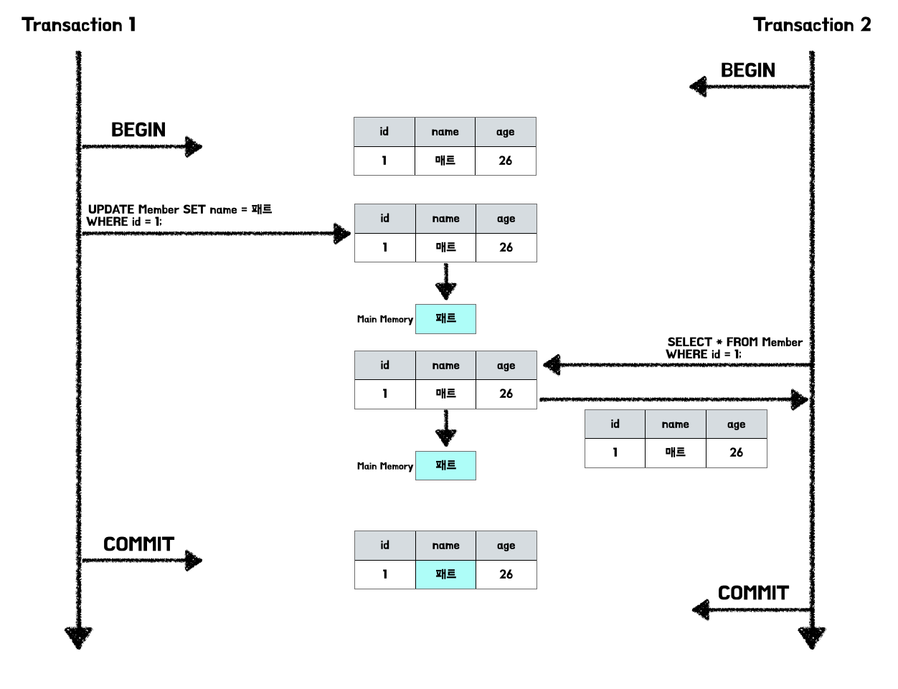
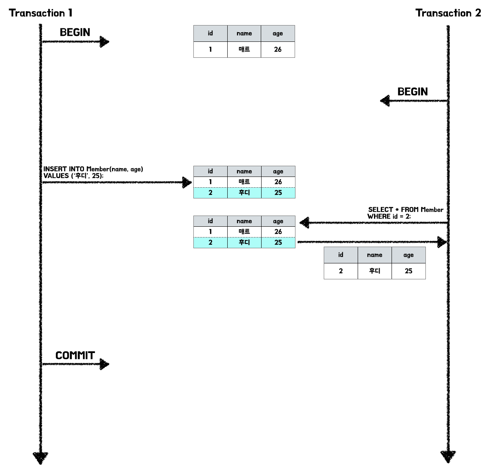
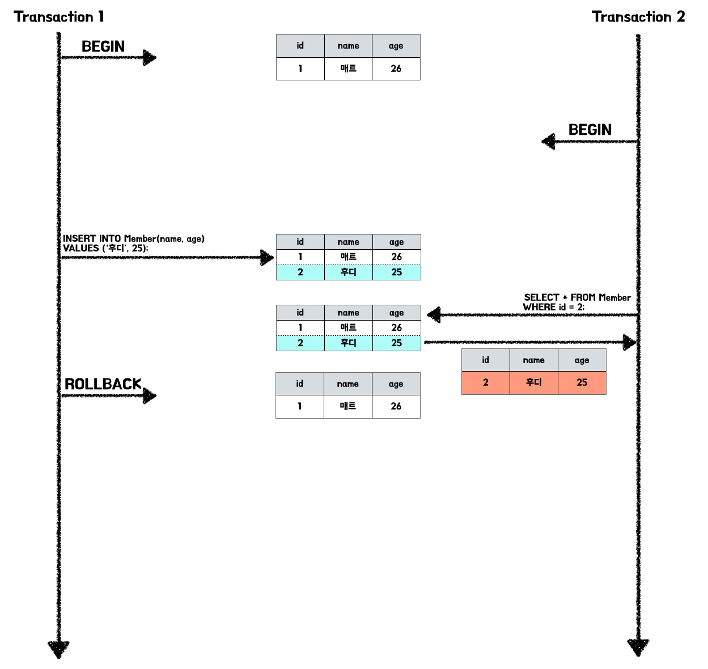
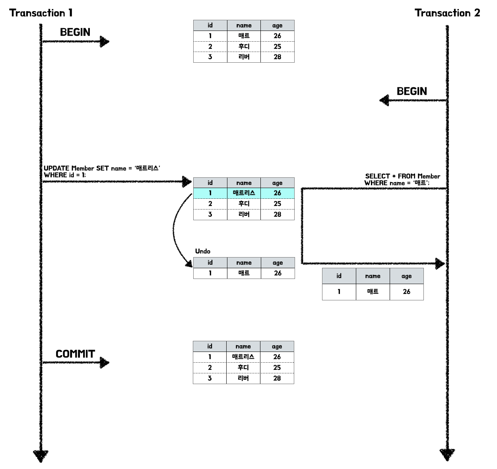
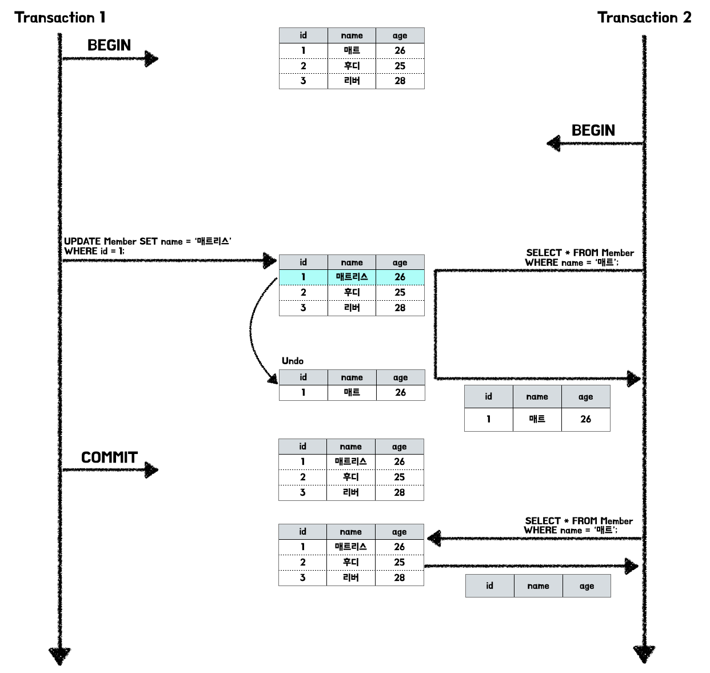
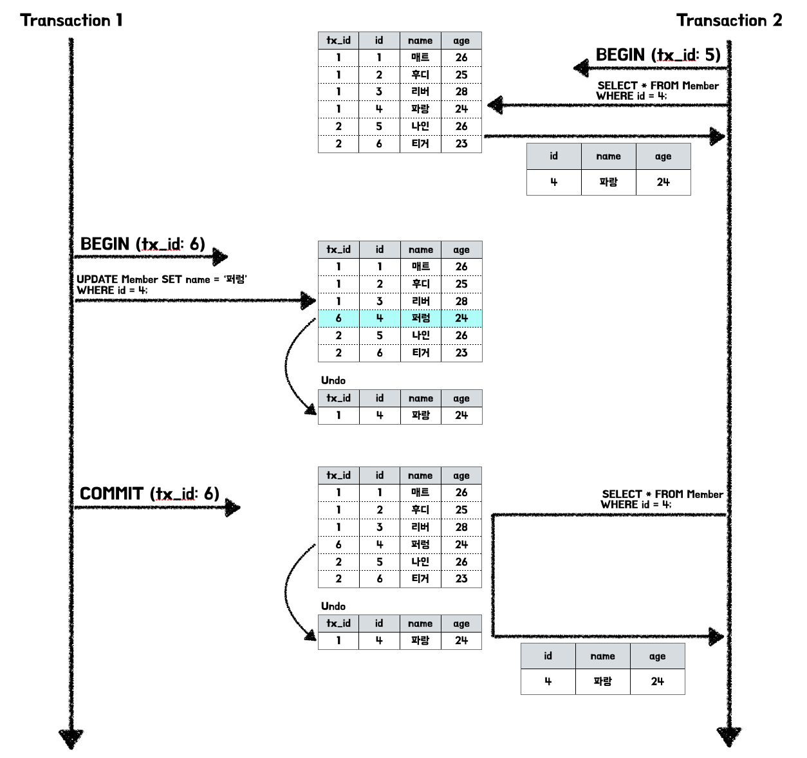
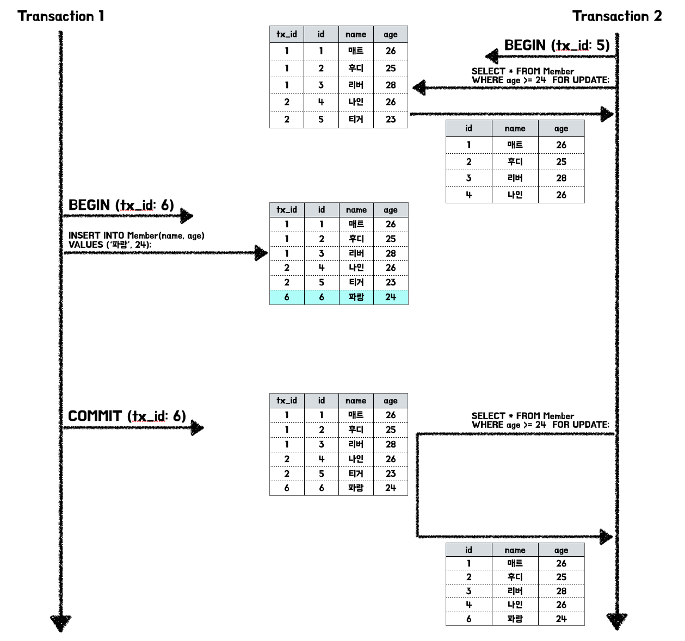
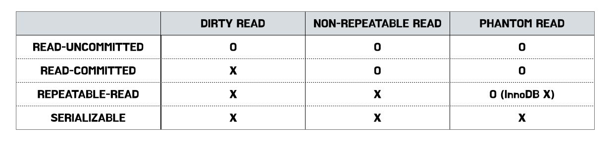

# 트랜잭션

<CenterImage image-src=https://user-images.githubusercontent.com/59357153/152970395-a31c8134-fc89-449f-b4dc-441e03df929c.png />

## 트랜잭션이란?

트랜잭션은 논리적인 작업 셋을 모두 `완벽하게 처리`하거나, `처리하지 못할 경우 원래 상태로 복구`하여 작업의 일부만 `적용되는 현상(Partial update)`을 막아준다.

또한 트랜잭션은 하나의 논리적인 작업 셋의 쿼리 개수와 관계없이 논리적인 작업 셋 자체가 `전부 적용(COMMIT)`되거나 `아무것도 적용되지 않는 것(ROLLBACK)`을 보장해주는 것이다. 결국 트랜잭션은 여러 개의 변경 작업을 수행하는 쿼리가 조합 됐을 때만 의미 있는 개념은 아니다.

트랜잭션은 `시작`과 `끝`이 존재하는 `절차(script)`이다. 트랜잭션은 이러한 절차의 시작과 끝을 `단위화`하는 것이다. 단위화된 트랜잭션은 반드시 `원자성`이 보장되어야 한다.

> **TPS Transactions per second**  
> 트랜잭션은 논리적인 작업 셋 단위화한 것이다. 초당 트랜잭션의 실행 수를 의미하는 TPS는 성능을 측정하는 지표로 사용된다.

## 트랜잭션의 특성 ACID

### Atomicity (원자성)

- 트랜잭션은 DB에 모두 반영되거나, 전혀 반영되지 않아야 한다.
- 완료되지 않은 트랜잭션의 중간 상태를 데이터베이스에 반영 해서는 안 된다.

### Consistency (일관성)

- 트랜잭션 작업 처리 결과는 항상 일관성을 유지해야 한다.
- 데이터베이스는 항상 일관된 상태를 유지해야 한다. 일관적인 데이터베이스 상태는 다양한 제약 조건을 만족해야 한다는 것이다.

### Isolation (격리성)

- 둘 이상의 트랜잭션이 동시 실행되고 있을 때, 어떤 트랜잭션도 다른 트랜잭션 연산에 끼어들 수 없다.
- 각각의 트랜잭션은 서로 간섭 없이 독립적으로 이루어져야 한다.

### Durability (지속성)

- 트랜잭션이 성공적으로 완료 되었으면 결과는 영구적으로 반영되어야 한다.
- 이것을 위해 모든 트랜잭션은 로그로 남겨져 어떠한 장애에도 대비할 수 있도록 한다.

보통 데이터가 `영속` 되었다는 것은 HDD나 SSD와 같이 `디스크`에 저장되는 것을 의미한다. 특정 트랜잭션에서 기존에 존재하는 데이터를 수정할 경우 바로 디스크에 접근하여 영속된 데이터를 수정하는 것이 아니라 `COMMIT`이 일어나는 시점에 비로소 메인 메모리에 존재하는 수정된 데이터가 디스크에 `반영`된다.

`Transaction 1`이 영속된 데이터를 수정한다고 가정한다. 아직 `COMMIT`되기 이전 이기 때문에 디스크에는 반영되어 있지 않은 상태이다. 그 때 또 다른 `Transaction 2`가 해당 데이터를 읽기 위해 시도하고 있다. 트랜잭션 2는 현재 영속되어 있는 데이터를 읽기 때문에 트랜잭션 1에서 수정된 변경 사항을 확인하지 못한 채 이전 데이터를 읽을 것이다. 결국 `Transaction 1`이 `COMMIT`되면 `Transaction 2`는 잘못된 데이터를 조회한 것과 다름없다. 

과연 이것은 온전히 트랜잭션의 특성을 보장한다고 말할 수 있을까? 하나의 데이터를 두 트랜잭션이 접근하려 시도할 경우 각각의 트랜잭션을 `순차적으로 실행`하지 않는 한 두 트랜잭션은 완전히 격리 되었다고 판단할 수 없을 것이다.

하지만 모든 트랜잭션을 `순차적으로 처리`할 경우 동시 처리 성능이 매우 나빠질 것이다. 이러한 ACID는 트랜잭션이 `이론적으로 보장해야 하는 성질`과 같다. 실제로는 `트랜잭션 격리 수준`에 따라 성능을 위해 `ACID 특성을 보장하는 것을 완화`하여 적용할 수 있다.

## 트랜잭션 격리 수준

트랜잭션 격리 수준은 트랜잭션이 동시에 데이터베이스에 접근할 때 그 접근을 어떻게 제어 할지에 대한 설정을 다룬다. 

- `READ UNCOMMITTED`
- `READ COMMITTED`
- `REPEATABLE READ`
- `SERIALIZABLE`

> 데이터의 정합성은 성능은 `반비례`한다. 아래로 갈수록 격리 수준과 데이터 정합성은 높아 지지만 성능은 떨어진다.

### READ UNCOMMITTED

커밋 전의 트랜잭션의 데이터 변경 내용을 다른 트랜잭션이 읽는 것을 허용한다.

`Transaction 1`에서 `INSERT`로 추가된 Member가 `COMMIT`되기 이전에 `Transaction 2`에서 조회를 진행하고 있다.

하지만 `Transaction 1`에서 모종의 이유로 `ROLLBACK`된다고 가정한자. `Transcation 2`는 `ROLLBACK` 여부를 확인하지 못하고 정상적인 Member라 생각하고 계속 진행될 것이다.

이처럼 트랜잭션에서 처리한 작업이 완료 되지 않아도 볼 수 있는 현상을 `Dirty Read`라고 한다. 이러한 `Dirty Read`가 허용되는 격리 수준은 `READ UNCOMMITTED`이다.

### READ COMMITTED

`COMMIT`이 완료된 트랜잭션의 변경사항만 다른 트랜잭션에서 조회가 가능하다. 대부분의 RDB에서 기본적으로 사용하고 있는 격리 수준이며, `Dirty Read`가 발생하지 않는다. 데이터의 변경이 일어나면 변경 전 데이터는 `언두 영역`으로 복사된다. 다른 트랜잭션에서 접근하면 변경된 테이블 데이터를 조회하는 것이 아니라 `언두 영역`에 복사된 레코드를 조회한다.

하지만 `READ COMMITTED`는 `NON REPEATABLE READ`가 발생하게 된다.

`Transaction 2`에서 `Transaction 1` `COMMIT` 이전 데이터를 조회하면 `1건`이 조회된다. 하지만 `Transaction 2`에서 `Transaction 1`이 정상적으로 `COMMIT` 된 이후 똑같은 `SELECT` 쿼리를 사용하여 다시 조회할 경우 `0건`이 조회된다. 이것은 `하나의 트랜잭션 내에서 똑같은 SELECT 쿼리를 실행 했을 때 항상 같은 결과를 가져와야 하는 REPEATABLE READ의 정합성`에 어긋난다.

### REPEATABLE READ

트랜잭션 범위 내에서 조회한 내용이 항상 동일함을 보장한다. 이 격리 수준에서는 `READ COMMITTED`에서 발생한 `NON REPEATABLE READ 부정합`이 발생하지 않는다.

InnoDB를 사용하는 MySQL의 경우 트랜잭션에 `순차적인 고유한 번호`를 가진다. `언두 영역`에 백업된 레코드에는 `변경을 발생 시킨 트랜잭션의 번호`를 포함하고 있다. 

InnoDB를 사용하는 MySQL에서 `REPEATABLE READ`를 보장하기 위해 자신의 트랜잭션 번호보다 작은 트랜잭션 번호에서 변경한 것만 읽도록 한다.

위 그림을 살펴보면 `Transaction 1`의 트랜잭션 번호는 `6번`이다. `Transaction 2`의 번호는 `5번`이다. `Transaction 1`은 특정 데이터를 수정한 뒤 `COMMIT`을 진행 했지만, 트랜잭션 번호가 더 낮은 `Transaction 2`는 자신의 트랜잭션 번호보다 작은 `언두 영역`에 백업된 레코드를 조회한다.

`READ COMMITTED`와 유사해보이지만 가장 큰 차이점은 `언두 영역`에 백업된 레코드의 여러 버전 가운데 몇 번째 이전 버전까지 찾아 들어가는지 이다.

> 언두 영역의 백업된 데이터는 여러 개일 수 있다. InnoDB가 불필요하다 판단하면 주기적으로 삭제한다. 언두 영역에 데이터가 늘어나면 MySQL 처리 성능이 떨어질 수 있기 때문이다.

`SQL-92` 혹은 `SQL-99` 표준에 따르면 `REPEATABLE READ`에서도 문제는 발생한다. 바로 `PHANTOM READ`이다. `PHANTOM READ`란 다른 트랜잭션에서 수행한 변경 작업으로 인하여 데이터가 보였다가 안보였다가 하는 현상을 의미한다. 

하지만 InnoDB를 사용하는 MySQL은 `넥스트 키 락` 덕분에 단순한 `SELECT`에서는 `PHANTOM READ`가 발생하지 않는다고 한다. (자세한 내용은 추후 공부할 예정이다.)

다만 `SELECT … FOR UPDATE`, `SELECT … FOR SHARE`와 같이 조회 시 `잠금`을 설정할 경우 `언두 영역`의 레코드는 잠금을 걸 수 없기 때문에 `PHANTOM READ`가 발생할 수 있다.

앞서 언급한 것 처럼 `언두 영역`의 레코드에 잠금을 걸 수 없기 때문에 변경 전 데이터를 가져오는 것이 아닌 현재 레코드의 값을 가져오기 때문에 이전에 `4건`의 레코드를 조회하는 것과 달리 총 `5건`의 레코드가 조회된다.

### SERIALIZABLE

가장 단순하고 엄격한 격리 수준이다. 단순한 SELECT 문도 트랜잭션이 끝날 때 까지 잠금이 설정되어 다른 트랜잭션에서 절대 접근할 수 없게 된다.

`SERIALIZABLE`은 `PHANTOM READ`를 문제가 발생하지 않는다. 다만 InnoDB를 사용하는 MySQL의 경우 이미 `REPEATABLE-READ`에서 `PHANTOM READ`가 발생하지 않도록 보장하기 때문에 `SERIALIZABLE` 격리 수준은 더욱 불필요해 보인다.

## 격리 수준 비교

## 회고

지금까지 트랜잭션에 대한 개념 및 격리 수준에 대해 알아보았다. 트랜잭션에 대해 막연한 개념만 가지고 있던 중, 각각의 격리 수준에 따른 접근 제어에 대한 궁금증으로 정리하게 되었다. 공부를 하며 가장 인상 깊었던 부분은 MySQL의 InnoDB 스토리지 엔진의 독특한 특성으로 상대적으로 낮은 격리 수준에서 `PHANTOM READ`를 예방할 수 있다는 것이다. 

아직 내부 동작 구조 및 아키텍처 등 부족한 지식이 많아 잘못된 개념이 있을 수 있다. 이번에 공부하며 추가적으로 얻은 키워드를 기반으로 차근차근 정리할 예정이다.

## References.

백은빈, 이성욱, 『Real MySQL 8.0』, 위키북스(2021), p176 ~ 183.  
[🙈[DB이론] 트랜잭션(transaction)과 ACID 특성을 보장하는 방법🐵](https://victorydntmd.tistory.com/129) 
[트랜잭션의 격리 수준(isolation Level)이란?](https://nesoy.github.io/articles/2019-05/Database-Transaction-isolation) 
[MySQL 트랜잭션 Isolation Level로 인한 장애 사전 예방법](https://gywn.net/2012/05/mysql-transaction-isolation-level/) 
[DB 트랜잭션에 대해서 말해보세요. (신입 면접용)](https://www.youtube.com/watch?v=7yuGlqPo8XQ&list=PLXvgR_grOs1DEoZFABFCjo7dsXt1BhVih&index=6) 
[InnoDB Next-Key Locking (phantom row 방지 기법)](https://m.blog.naver.com/PostView.naver?isHttpsRedirect=true&blogId=seuis398&logNo=70117139617) 
[Non-Repeatable Read VS Phantom Read](https://github.com/woowacourse-study/2022-Real-MySQL/issues/8)

<TagLinks />
