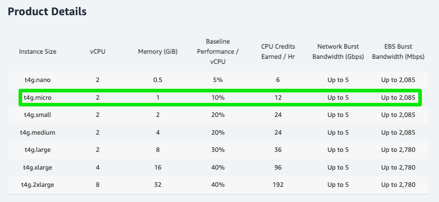

# Swap Memory

<CenterImage image-src=https://user-images.githubusercontent.com/59357153/152970395-a31c8134-fc89-449f-b4dc-441e03df929c.png />

## Amazon EC2 T4g 인스턴스

EC2 T4g 인스턴스는 `Arm` 기반 AWS Gravition2 프로세서로 구동되며 T3 인스턴스에 비해 최대 40% 더 나은 가격 성능을 제공한다. 다양한 상품이 존재하지만 우리에게 허락된 사양은 `2개의 vCPU`와 `1GB` 메모리를 가진 `t4g.micro` 뿐이었다.



## 프로젝트 빌드하기

현재 `달록`의 백엔드는 `Java + Spring Boot`를 활용하여 API 서버를 구축하고 있다. 현재 백엔드 프로젝트는 `github actions`를 활용한 CI 과정 중 1번, jenkins가 설치된 ec2 내부에서 추가적인 빌드 파일 생성을 위해 1번으로 총 `2번의 빌드 과정`을 거친다. 

github actions는 우리가 관리하는 서버의 리소스를 사용하는 것이 아닌 github 내부에서 관리하는 서버를 통해 빌드가 진행된다. 그렇기 때문에 서버의 사양에 신경쓰지 않고 빌드의 성공 여부에 집중할 수 있다.

하지만 우리가 관리하는 EC2는 입장이 다르다. 현재 사용할 수 있는 서버의 리소스는 한정되어 있으며 jenkins 서버의 운영과 java 프로젝트의 빌드를 함꼐 진행하는 입장에서 `1GB` 메모리는 터무니 없이 부족하다. 더군다나 우리는 서버의 사양을 마음대로 조정할 수 없는 위치에 있기 때문에 해결할 수 있는 방법을 모색해야 했다.

## Swap Memory 도입

`Swap Memory`는 메인 메모리를 담당하는 `RAM`이 가득 찬 경우 더 많은 메모리 사용을 위해 디스크 공간의 일부를 대체하여 사용하는 것이다. 이것은 실제 디스크 공간을 메모리 처럼 활용하기 때문에 가상 메모리라고 할 수 있다. 

물론 실제 메모리를 사용하는 것이 아닌 말 그대로 디스크 공간을 가상 메모리로 사용하는 것이기 때문에 속도면에서 차이가 날 수 있다. 그럼에도 사용하는 이유는 실제 메모리가 부족한 시점에 시스템에 장애가 발생하는 것 보다 이러한 공간을 추가적으로 사용하여 안정성을 높일 수 있다.

### Swap Memory 설정

```bash
$ sudo fallocate -l 2G /swapfile
```

 * `fallocate`: 특정 이름을 가진 특정 크기의 파일을 만드는 명령어이다. `-l`을 통해 사이즈를 지정할 수 있다.
 * `-l 2G`: 2G 크기의 파일을 할당한다. 다른 단위의 크기를 만들고 있으면 `K`, `M`, `T`등을 사용할 수 있다.

보통 `Swap Memory`는 `RAM 크기의 2배`로 설정하는 것이 좋다고 한다. 우리는 `1GB`의 메모리를 가지고 있기 때문에 `2G`로 설정하였다.

### swapfile 권한 추가

```bash
$ sudo  chmod 600 /swapfile
```

앞서 만든 `swapfile`의 권한을 수정한다.

### Swap Memory 활성화

```bash
$ sudo mkswap /swapfile
$ sudo swapon /swapfile
```

### 시스템 재부팅 시 Swap Memory 적용하도록 설정

```bash
$ sudo vim /etc/fstab
```

아래 내용을 추가한다.

```bash
/swapfile swap swap defaults 0 0
```

## 정리

이제 한정된 메인 메모리와 추가적인 가상 메모리를 통해 프로젝트 빌드를 성공적으로 진행할 수 있다. 단순히 제품 사양을 올리는 것 보다 Swap Memory를 통해 해결하는 방법에 대해 익힐 수 있었으며 보다 더 안정적인 서버 운영을 진행할 수 있도록 세팅할 수 있는 계기가 되었다.

### References.

[Amazon EC2 T4g 인스턴스, 서울 리전 출시 (6월 30일까지 무료 사용 가능)](https://aws.amazon.com/ko/blogs/korea/amazon-ec2-t4g-instance-seoul-region/)<br>
[[리눅스] 스왑 메모리(Swap Memory) 메모리](https://scbyun.com/984)<br>
[[Tip] Ubuntu 20.04 Swap 메모리 설정하기](https://facerain.club/swap-memory/)

<TagLinks />
