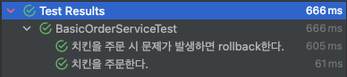

# Transactional

<CenterImage image-src=https://user-images.githubusercontent.com/59357153/152970395-a31c8134-fc89-449f-b4dc-441e03df929c.png />

## 트랜잭션이란?

트랜잭션은 작업의 `완전성`을 보장해준다. 논리적인 작업 셋을 모두 `완벽하게 처리`하거나, `처리하지 못할 경우 원 상태로 복구`하여 작업의 일부만 `적용되는 현상(Partial update)`을 막아준다.

또한 트랜잭션은 하나의 논리적인 작업 셋에 쿼리 개수에 관계없이 논리적인 작업 셋 자체가 `전부 적용(COMMIT)`되거나 `아무것도 적용되지 않는 것(ROLLBACK)`을 보장해주는 것이다. 결국 트랜잭션은 여러 개의 변경 작업을 수행하는 쿼리가 조합됐을 때만 의미 있는 개념은 아니다. 

아래는 트랜잭션에 대한 이해를 돕기 위해 간단한 시나리오를 준비했다. 

### 치킨 주문 시나리오

 * 손님이 치킨을 주문한다. 후라이드 치킨 한 마리의 가격은 20000원이다.
 * 주문과 동시에 손님의 잔고는 20000원이 감소한다.
 * 치킨집 사장님은 잔고가 20000원이 증가한다.
 * 주문이 완료되면 조리가 시작된다.

위 과정은 하나의 논리적인 작업 셋으로 이루어져 있다. 이 작업이 모두 성공하여 `데이터베이스에 정상적으로 반영`되어야만 20000원을 지불한 뒤 따끈한 치킨을 맛볼 수 있다.

만약 모종의 이유로 치킨집 사장님의 잔고가 채워지지 않는다면 이미 지불된 손님의 잔고를 원상태로 돌려야 할 것이다. 이렇게 작업 중 하나라도 실패하게 되는 경우 거래 이전으로 되돌리기 위해 rollback을 진행해야 한다.

## 어디에 트랜잭션을 적용해야 할까?

앞서 언급한 것 처럼 트랜잭션은 논리적인 작업 셋을 기준으로 적용된다. 이러한 작업 셋은 대부분 애플리케이션의 중요 로직이 담긴 서비스 계층에서 이루어진다. 이러한 비즈니스 로직 중 일부가 잘못되면 문제가 되는 부분과 함께 rollback 되어야 한다. 

트랜잭션 시작을 위해서는 데이터베이스 연결을 위한 커넥션이 필요하다. 서비스 계층에서 트랜잭션을 적용하기 위해 커넥션을 만들고 `COMMIT` 혹은 `ROLLBACK`하는 과정이 필요하다.

## 트랜잭션 적용하기

아래는 위 시나리오를 기반으로 서비스 계층에서 다양한 방식으로 트랜잭션 처리를 작성한 예시이다. 예시 작성을 위한 개발 환경은 아래와 같다.

 * Java 11 
 * Spring Boot 2.7.3
 * Spring JDBC
 * H2 Database

모든 예시는 [github repository](https://github.com/hyeonic/blog-code/tree/main/transaction)에서 확인할 수 있다.

아래는 예시 작성을 위한 테이블 구조이다.

```sql
drop table if exists member CASCADE;
drop table if exists order_detail CASCADE;

create table member
(
    id    bigint generated by default as identity,
    money integer not null,
    primary key (id)
);

create table order_detail
(
    id            bigint generated by default as identity,
    product_name  varchar(255) not null,
    product_price integer      not null,
    customer_id   bigint       not null,
    owner_id      bigint       not null,
    primary key (id)
);

alter table order_detail
    add constraint FK30tg6hosx2u0852u9wo8ocmfg
        foreign key (customer_id)
            references member;

alter table order_detail
    add constraint FKokxrof4wf328mj2p02odclhh9
        foreign key (owner_id)
            references member;
```

먼저 손님과 사장을 표현하기 위한 Member 객체이다. 잔고의 돈을 관리하기 위한 행위를 가지고 있다.

```java
public class Member {

    private Long id;
    private Integer money;

    public Member(final Long id, final Member member) {
        this(id, member.getMoney());
    }

    public Member(final Integer money) {
        this(null, money);
    }

    public Member(final Long id, final Integer money) {
        this.id = id;
        this.money = money;
    }

    public void plusMoney(final Integer price) {
        this.money += price;
    }

    public void minusMoney(final Integer price) {
        this.money -= price;
    }

    public Long getId() {
        return id;
    }

    public Integer getMoney() {
        return money;
    }
}
```

다음은 주문 정보를 관리하기 위한 `OrderDetail`이다. 상품의 이름과 가격, 구매자와 판매자에 대한 정보를 가지고 있다. 각각의 구매자와 판매자의 잔고가 반영되면 주문 정보가 데이터베이스에 추가될 것이다.


```java
public class OrderDetail {

    private Long id;
    private String productName;
    private Integer productPrice;
    private Long customerId;
    private Long ownerId;

    public OrderDetail(final Long id, final OrderDetail orderDetail) {
        this(id, orderDetail.getProductName(), orderDetail.getProductPrice(), orderDetail.getCustomerId(),
                orderDetail.getOwnerId());
    }

    public OrderDetail(final String productName, final Integer productPrice, final Long customerId,
                       final Long ownerId) {
        this(null, productName, productPrice, customerId, ownerId);
    }

    public OrderDetail(final Long id, final String productName, final Integer productPrice, final Long customerId,
                       final Long ownerId) {
        this.id = id;
        this.productName = productName;
        this.productPrice = productPrice;
        this.customerId = customerId;
        this.ownerId = ownerId;
    }

    public Long getId() {
        return id;
    }

    public String getProductName() {
        return productName;
    }

    public Integer getProductPrice() {
        return productPrice;
    }

    public Long getCustomerId() {
        return customerId;
    }

    public Long getOwnerId() {
        return ownerId;
    }
}
```

### 프로그래밍 방식 트랜잭션 관리

앞서 작성한 객체를 기반으로 서비스 계층에 주문을 위한 로직을 추가한다.

```java
@Service
public class BasicOrderService {

    private final DataSource dataSource;
    private final MemberRepository memberRepository;
    private final OrderDetailRepository orderDetailRepository;

    public BasicOrderService(final DataSource dataSource, final MemberRepository memberRepository,
                             final OrderDetailRepository orderDetailRepository) {
        this.dataSource = dataSource;
        this.memberRepository = memberRepository;
        this.orderDetailRepository = orderDetailRepository;
    }

    public void order(final OrderRequest request) throws SQLException {
        Connection connection = dataSource.getConnection(); // 1
        try {
            connection.setAutoCommit(false); // 2

            Member customer = memberRepository.findById(request.getCustomerId());
            Member owner = memberRepository.findById(request.getOwnerId());

            customer.minusMoney(request.getProductPrice()); // 3
            owner.plusMoney(request.getProductPrice()); // 4

            memberRepository.update(customer); // 5
            memberRepository.update(owner); // 6

            OrderDetail orderDetail =
                    new OrderDetail(request.getProductName(), request.getProductPrice(), customer.getId(), owner.getId());

            orderDetailRepository.save(orderDetail); // 7

            connection.commit(); // 8
        } catch (Exception e) {
            connection.rollback(); // 9
            throw new IllegalStateException(e);
        } finally {
            connection.close();
        }
    }
}
```

 * `1`: 먼저 dataSource에서 데이터베이스 접근을 위한 커넥션을 가져온다.
 * `2`: 해당 커넥션의 자동 커밋에 대한 기본 설정은 `true`이다. 트랜잭션 처리를 위해 자동 커밋을 해제한다.
 * `3, 4`: 손님의 잔고를 감소시킨다. 사장님의 잔고는 증가시킨다.
 * `5, 6`: 변경된 손님과 사장님의 잔고를 반영한다. 아직 커밋 되지 않았기 때문에 데이터베이스에는 반영되지 않은 상태이다.
 * `7`: 주문 정보를 저장한다.
 * `8`: 트랜잭션을 커밋한다. 
 * `9`: 트랜잭션 처리 중 예외가 발생하면 롤백한다.

아래는 주문 로직 점검을 위한 테스트 코드이다.

```java
@SpringBootTest
class BasicOrderServiceTest {

    @Autowired
    private MemberRepository memberRepository;

    @Autowired
    private BasicOrderService basicOrderService;

    @DisplayName("치킨을 주문한다.")
    @Test
    void 치킨을_주문한다() throws SQLException {
        // given
        Member customer = memberRepository.save(new Member(50_000));
        Member owner = memberRepository.save(new Member(100_000));

        OrderRequest request = new OrderRequest("후라이드 치킨", 20000, customer.getId(), owner.getId());

        // when
        basicOrderService.order(request);

        // then
        Member foundCustomer = memberRepository.findById(customer.getId());
        Member foundOwner = memberRepository.findById(owner.getId());

        assertAll(() -> {
            assertThat(foundCustomer.getMoney()).isEqualTo(30_000);
            assertThat(foundOwner.getMoney()).isEqualTo(120_000);
        });
    }

    @DisplayName("치킨을 주문 시 문제가 발생하면 rollback한다.")
    @Test
    void 치킨을_주문_시_문제가_발생하면_rollback한다() {
        // given
        Member customer = memberRepository.save(new Member(50_000));
        Member owner = memberRepository.save(new Member(100_000));

        OrderRequest request = new OrderRequest("후라이드 치킨", 20000, null, owner.getId());

        // when
        // customerId not null 제약 조건으로 예외 발생
        assertThatThrownBy(() -> basicOrderService.order(request))
                .isInstanceOf(IllegalStateException.class);

        // then
        Member foundCustomer = memberRepository.findById(customer.getId());
        Member foundOwner = memberRepository.findById(owner.getId());

        assertAll(() -> {
            assertThat(foundCustomer.getMoney()).isEqualTo(50_000);
            assertThat(foundOwner.getMoney()).isEqualTo(100_000);
        });
    }
}
```



의도한 대로 잘 동작하는 것을 확인할 수 있다.

하지만 위 코드에는 많은 `문제점`을 가지고 있다.
 * 매번 커넥션을 얻기 위한 중복 코드가 많아진다.
 * 서비스 계층은 애플리케이션의 핵심 비즈니스 로직을 담당한다. 데이터베이스의 트랜잭션을 위해 커넥션을 획득하고 try, catch하는 등의 부가적인 코드는 관심사가 아니다.
 * `SQLException`과 같이 `특정 기술(JDBC)에 종속적인 코드`가 서비스 계층에 들어간다. 추후 JPA로 변경된다면 JDBC에 의존하는 개념들을 `직접 접근하여 변경`해야 한다.

### 선언적 트랜잭션 관리

트랜잭션은 보통 아래와 같은 순서로 진행된다.

 * `트랜잭션 시작`
 * 비즈니스 로직 수행
 * `커밋 혹은 롤백 이후 트랜잭션 종료`

Spring은 `@Transactional`을 통해 트랜잭션 시작과 트랜잭션 종료에 대한 로직을 클래스 밖으로 분리하도록 지원한다. 빈 생성 시 `@Transactional`의 유무를 확인한 뒤 프록시 객체를 빈으로 등록한다. 자세한 내용은 [[10분 테코톡] 후니의 스프링 트랜잭션](https://www.youtube.com/watch?v=cc4M-GS9DoY&t=50s)에서 확인할 수 있다. 결국 `@Transactional` 애노테이션을 사용하면 아래와 같이 핵심 비즈니스 로직만 코드에 남길 수 있다. 

```java
@Service
public class DeclarativeOrderService {

    private final MemberRepository memberRepository;
    private final OrderDetailRepository orderDetailRepository;

    public DeclarativeOrderService(final MemberRepository memberRepository,
                                   final OrderDetailRepository orderDetailRepository) {
        this.memberRepository = memberRepository;
        this.orderDetailRepository = orderDetailRepository;
    }

    @Transactional
    public void order(final OrderRequest request) {
        Member customer = memberRepository.findById(request.getCustomerId());
        Member owner = memberRepository.findById(request.getOwnerId());

        customer.minusMoney(request.getProductPrice());
        owner.plusMoney(request.getProductPrice());

        memberRepository.update(customer);
        memberRepository.update(owner);

        OrderDetail orderDetail =
                new OrderDetail(request.getProductName(), request.getProductPrice(), customer.getId(), owner.getId());

        orderDetailRepository.save(orderDetail);
    }
}
```

앞서 작성한 테스트도 동일하게 통과하는 것을 확인할 수 있다.

## 정리

Spring이 제공하는 선언적 트랜잭션 관리를 통해 서비스 계층에 트랜잭션 관련 코드와 특정 기술에 대한 의존성을 제거할 수 있게 되었다. 이제 데이터베이스에 대한 접근 기술이 변경되어도 적절히 추상화된 트랜잭션을 통해 논리적인 작업 셋의 데이터 `완전성`을 지킬 수 있게 된다. 우리는 데이터베이스의 커넥션을 획득하고 COMMIT, ROLLBACK 등 부가적인 코드에 집중하기 보다 비즈니스 로직에 집중할 수 있는 환경이 마련 되었다.

### References.

백은빈, 이성욱, 『Real MySQL 8.0』, 위키북스(2021), p155. <br>
[[10분 테코톡] 후니의 스프링 트랜잭션](https://www.youtube.com/watch?v=cc4M-GS9DoY&t=50s)

<TagLinks />
