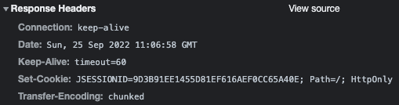

# 02. 톰캣 구현하기

이전 미션 이후 추가적인 리팩터링과 동시성 확장을 위한 기능들을 추가 하였다. 대부분의 리팩터링은 1단계 제출을 진행하며 대부분 적용하였다. 때문에 이번에 추가된 기능인 서버 세션 관리를 위한 주체를 어디에 둬야할지, 톰캣 튜닝을 위한 각각의 설정들은 어떤 것을 의미하는지 등에 집중하며 미션을 진행했다.

> 이 글은 우아한테크코스에서 진행한 미션의 리뷰와 나의 고민, 생각에 대해 정리한다. 실제 리뷰는 [[톰캣 구현하기 - 2, 3, 4단계] 매트(최기현) 미션 제출합니다.](https://github.com/woowacourse/jwp-dashboard-http/pull/224)에서 확인할 수 있다.

## 요구사항 파악하기

이번 미션은 크게 `4 단계`로 이루어져 있다. 아래는 각 단계 별 체크 리스트 중 이번 2차 제출에서 구현한 것을 표시한 것이다.

### 🚀 1단계 - HTTP 서버 구현하기

 * [x] http://localhost:8080/index.html 페이지에 접근 가능하다.
 * [x] 접근한 페이지의 js, css 파일을 불러올 수 있다.
 * [x] uri의 QueryString을 파싱하는 기능이 있다.

### 🚀 2단계 - 로그인 구현하기

 * [x] HTTP Reponse의 상태 응답 코드를 302로 반환한다.
 * [x] POST로 들어온 요청의 Request Body를 파싱할 수 있다.
 * [x] 로그인에 성공하면 HTTP Reponse의 헤더에 Set-Cookie가 존재한다.
 * [x] 서버에 세션을 관리하는 클래스가 있고, 쿠키로부터 전달 받은 JSESSIONID 값이 저장된다.

### 🚀 3단계 - 리팩터링

 * [x] HTTP Request, HTTP Response 클래스로 나눠서 구현했다.
 * [x] Controller 인터페이스와 RequestMapping 클래스를 활용하여 if절을 제거했다.

### 🚀 4단계 - 동시성 확장하기

 * [x] Executors로 만든 ExecutorService 객체를 활용하여 스레드 처리를 하고 있다.

2차 제출을 최종 제출이라 가정한 뒤 모든 요구사항을 해결하였다.

## HttpRequest, HttpResponse 구현

[RFC2616](https://datatracker.ietf.org/doc/html/rfc2616#section-6.1)에 명세된 내용을 참고하여 `HttpRequest`와 `HttpResponse` 객체를 추가한다. connection을 통해 전달된 데이터를 적절히 분리하여 Java 객체에서 활용할 수 있도록 작성한다.

### HttpRequest

```java
public class HttpRequest {

    private RequestLine requestLine;
    private Headers headers;
    private String body;
    private RequestParameters requestParameters;

    public HttpRequest(final String startLine) {
        String[] splitStartLine = startLine.split(" ");
        this.requestLine = new RequestLine(splitStartLine[0], splitStartLine[1], splitStartLine[2]);
        this.headers = new Headers();
        this.body = "";
        this.requestParameters = RequestParameters.EMPTY_PARAMETERS;
    }
    ...
}
```

### HttpResponse

```java
public class HttpResponse {
    ...
    private StatusLine statusLine;
    private Headers headers;
    private String body;

    public HttpResponse() {
        this.statusLine = new StatusLine();
        this.headers = new Headers();
        this.body = "";
    }
    ...
}
```

크게 어려운 부분은 없었지만 아무것도 정제되지 않은 문자열을 분할하고 저장해야 했기 때문에 적절한 객체에게 어떠한 책임을 줘야하는지 가장 크게 고민하였다. 우선 최대한 HttpRequest와 HttpResponse에 포함된 구성요소들을 객체로 분리한 뒤 처리할 수 있는 책임을 적절히 부여할 수 있도록 노력하였다.

그중 가장 크게 고민한 것은 세션 정보를 생성하기 위한 주체를 어떤 객체에게 부여하는지 였다.

## 세션

세션이란 서버-클라이언트 모델에서 서버로 요청한 클라이언트를 `식별하기 위한 방법` 중 하나이다. 서버는 특정 시점(e.g. 로그인 등)에 요청한 클라이언트에게 `Set-Cookie` 헤더를 포함한 응답을 통해 서버 세션 값을 전달한다.

서버 측은 이러한 세션 정보 관리를 위해 내부에 저장소를 통해 관리한다. 그렇다면 기존 톰캣은 언제 어느 시점에 세션을 생성하여 클라이언트에게 전달해주는 것인가?

실제 `HttpServletRequest` 객체의 `getSession()` 메서드를 살펴보았다. 

> **public HttpSession getSession(boolean create)**  
> <br/>
> Returns the current HttpSession associated with this request or, if there is no current session and create is true, returns a new session.  
>
> 이 요청과 연결된 현재 HttpSession을 반환하거나, 현재 세션이 없고 create가 true이면 새 세션을 반환한다.  
> <br/>
> If create is false and the request has no valid HttpSession, this method returns null.  
>
> create가 false이고 요청에 유효한 HttpSession이 없으면 이 메서드는 null을 반환한다.  
> <br/>
> To make sure the session is properly maintained, you must call this method before the response is committed. If the container is using cookies to maintain session integrity and is asked to create a new session when the response is committed, an IllegalStateException is thrown.
>
> 세션이 제대로 유지 관리 되도록 하기 위해 응답을 커밋하기 전에 이 메서드를 호출해야 한다. 컨테이너가 세션 무결성을 유지하기 위해 쿠키를 사용하고 응답이 커밋될 때 새 세션을 생성하도록 요청받는 경우 IllegalStateException이 발생한다.
> <br/>

정리하면 아래와 같이 `getSession()` 메서드를 호출하는 시점에 `JSESSIONID`가 생성되며 `Set-Cookie`를 통해 세션 아이디가 헤더가 추가된다는 것이다.

아래는 간단한 테스트를 위한 서블릿 객체이다.

```java
@WebServlet(urlPatterns = "/test")
public class MainServlet extends HttpServlet {

    @Override
    protected void doGet(final HttpServletRequest req, final HttpServletResponse resp) throws IOException {
        req.getSession();

        PrintWriter writer = resp.getWriter();
        writer.println("Hello world!");
        writer.flush();
    }
}
```



`Set-Cookie`를 통해 세션 아이디가 전달되는 것을 확인할 수 있다.

위 사례를 기반으로 세션을 생성하기 위한 주체를 `HttpRequest`로 정했다.

```java
public class HttpRequest {
    ...
    public Session getSession() {
        // 1
        if (headers.hasJSessionId()) {
            String jSessionId = headers.getJSessionId();
            return SessionManager.findSession(jSessionId);
        }

        // 2
        UUID uuid = UUID.randomUUID();
        Session session = new Session(uuid.toString());
        SessionManager.add(session);
        return session;
    }
    ...
}
```

 * `1`: 쿠키 헤더에 세션 아이디가 있는 경우 해당 세션 아이디에 해당하는 세션을 찾아 반환한다.
 * `2`: 세션 아이디가 존재하지 않는 경우 새롭게 세션을 생성한 뒤 반환한다.

이제 로그인 시점에 세션을 생성하여 응답 헤더에 전달한다.

```java
public class LoginServlet extends HttpServlet {
    ...
    private static final String PATH = "/login";
    ...
    protected void doPost(final HttpRequest httpRequest, final HttpResponse httpResponse) {
        String account = httpRequest.getRequestParameter("account");
        String password = httpRequest.getRequestParameter("password");

        if (InMemoryUserRepository.existsAccountAndPassword(account, password)) {
            login(httpRequest, httpResponse, account);
            return;
        }

        httpResponse.addStatusCode(StatusCode.UNAUTHORIZED);
        httpResponse.addView("401.html");
    }

    private void login(final HttpRequest httpRequest, final HttpResponse httpResponse, final String account) {
        User user = InMemoryUserRepository.findByAccount(account).orElseThrow(NoSuchUserException::new);
        log.info(user.toString());

        Session session = httpRequest.getSession();
        session.setAttribute("user", user);

        httpResponse.addCookie(session.parseJSessionId());
        httpResponse.sendRedirect("/index.html");
    }
}
```

아래는 로그인 페이지에 GET으로 접근할 경우 세션이 존재한다면 메인 페이지로 이동하기 위한 로직이다.

```java
public class LoginServlet extends HttpServlet {
    ...
    private static final String PATH = "/login";
    ...
    @Override
    protected void doGet(final HttpRequest httpRequest, final HttpResponse httpResponse) {
        Session session = httpRequest.getSession();

        User user = (User) session.getAttribute("user");
        if (Objects.nonNull(user)) {
            httpResponse.sendRedirect("/index.html");
            return;
        }

        httpResponse.addStatusCode(StatusCode.OK);
        httpResponse.addView("login.html");
    }
    ...
}
```

이번 미션에서 가장 많은 고민을 했던 부분이다. 실제로 톰캣이 내부적으로 어떠한 시점에 세션을 생성하는지 확실히 알고 싶었기 때문이다. 복잡한 내부 코드와 직관적이지 않은 공식 문서로 인해 이것을 파악하는데 생각보다 오랜 시간이 걸렸다. 

사실 이부분도 아직 확인은 없다. 몇몇 블로그에서는 세션의 생성 시점을 각 브라우저에서 해당 도메인을 최초 요청하는 시점이라고 하는데, 실제 서블릿을 생성한 뒤 진행해보면 전혀 다른 결과를 확인할 수 있었다. 보다 공신력있는 자료를 참고 하고 싶지만 쉽지 않았다.

우선 톰캣에 대한 큰 그림을 우선적으로 학습한 뒤 추후 궁금한 부분을 깊이 파보는 방식으로 하는 것이 적절하다 판단했다. 톰캣에 내부 구조를 파악하는데 에만 집중하다 보면 미션에서 추구하는 다양한 방향성을 놓칠 수도 있다고 생각했기 때문이다. 

## Executors를 활용한 Thread Pool

### 스레드 풀

기존 구조에서 어떤식으로 스레드가 할당되는지 살펴보자.

```java
public class Connector implements Runnable {
    ...
    @Override
    public void run() {
        while (!stopped) {
            connect();
        }
    }

    private void connect() {
        try {
            process(serverSocket.accept());
        } catch (IOException e) {
            log.error(e.getMessage(), e);
        }
    }

    private void process(final Socket connection) {
        if (connection == null) {
            return;
        }
        log.info("connect host: {}, port: {}", connection.getInetAddress(), connection.getPort());
        var processor = new Http11Processor(connection);
        new Thread(processor).start();
    }
    ...
}
```

매 요청이 들어오면 `serverSocket.accept()`을 통해 connection을 획득한다. 해당 connection을 통해 `Http11Processor`을 생성한 뒤 스레드를 생성하여 전달한다.

즉 매 요청 마다 스레드를 생성하는 구조이다. 이러한 구조는 다수의 요청에도 매번 새롭게 스레드를 생성하게 된다.

이렇게 무분별하게 스레드가 생성하게 되면 스레드 생성을 위한 비용과 다수의 스레드를 동시성 처리하기 위한 비용이 증가하게 된다. 이것은 결국 애플리케이션의 성능 저하로 이어질 수 있다.

이러한 문제를 해결하기 위해 미리 필요한 스레드를 생성한 뒤 재활용할 수 있다. 스레드 풀은 작업 처리에 사용되는 스레드 개수를 제한하여 생성한 뒤 작업 큐에 들어온 작업을 처리 가능한 스레드가 맡아 처리하게 된다.

Java에서는 이러한 스레드 풀 구현을 위해 `ExecutorService`와 `Executors`가 제공된다. 그중 대표적으로 사용하는 스레드 풀 생성 방법에 대해 몇 가지 알아보려 한다.

### `Executors.newFixedThreadPool(int nThreads)`

제한되지 않은 공유 대기열에서 작동하는 고정 개수의 스레드를 재사용하는 스레드 풀을 만든다. 어느 시점에서도 최대 nThreads는 활성 처리 작업이다. 모든 스레드가 활성 상태일 때 추가 작업이 제출되면 스레드를 사용할 수 있을 때 까지 대기열에 대기한다. 종료 전에 실행 중 오류로 인해 스레드가 종료되면 후속 작업을 실행하는 데 필요한 경우 새 스레드가 그 자리를 대신한다.

### `Executors.newCachedThreadPool()`

필요에 따라 새 스레드를 만들지만 이전에 생성된 스레드가 사용 가능할 때 재사용하는 스레드 풀을 만든다. 이러한 풀은 일반적으로 많은 단시간 비동기 작업을 실행하는 프로그램의 성능을 향상 시킨다. 실행 호출은 이전에 생성된 스레드를 재사용할 수 있는 경우 재사용한다. 사용할 수 있는 스레드가 없는 경우 새 스레드가 생성되어 풀에 추가된다. 60초 동안 사용되지 않는 스레드는 종료되어 캐시에서 제거된다. 따라서 충분히 오랫동안 유휴 상태로 남아 있는 풀은 리소스를 소비하지 않는다. 

### `execute()`

```java
public interface Executor {
    ...
    void execute(Runnable command);
}
```

지정된 명령을 나중에 실행한다. 명령어는 Executor 구현에 따라 새 스레드, 폴링된 스레드 또는 호출 스레드에서 실행될 수 있다.

### `submit(Runnable task)`

실행을 위해 Runnable 작업을 제출하고 해당 작업을 나타내는 `Future`를 반환합니다. Future의 get 메서드는 성공적으로 완료되면 null 을 반환한다.

## ConcurrnetHashMap

`HashMap`은 기본적으로 `synchronized` 키워드를 활용하지 않기 때문에 멀티 스레드 환경에서 공유 자원으로 활용할 경우 동시성 문제가 발생할 수 있다. 그렇다면 `HashTable`이 이러한 문제에 대안이 될 수 있을까? `HashTable`은 `synchronized` 키워드를 기반으로 작성되어 있기 때문에 스레드 세이프하다. 다만 Collections Framework가 나오기 이전에 사용하던 클래스로 `하위 호환성`을 위해 존재하므로 최근에는 잘 사용하지 않는다.

HashMap의 멀티 스레드 환경에서 단점을 보완하기 위해 등장한 클래스가 바로 `ConcurrnetHashMap`이다. 자세한 내부 동작 구조는 추후 학습을 통해 작성할 예정이다. 우선은 `ConcurrnetHashMap`을 사용하면 스레드 세이프와 원자성을 보장할 수 있다는 것만 알아두자.

## 정리 및 회고

직접 톰캣 서버를 만들어보며 서버의 역할은 무엇이고, 어떠한 문제를 해결하기 위해 등장했는지 고민할 수 있는 시간이 되었다. 이전에 톰캣을 사용할 때는 단순히 Spring Boot에 내장되어 있었기 때문에 크게 신경 쓰지 않고 비즈니스 로직을 작성했다. 다수의 요청을 처리하기 위해서는 내부에서 신경쓰고 고려해야 할 부분이 많다는 것을 느꼈다. 또한 잘 작성된 라이브러리 혹은 프레임워크를 쓰기 위해서는 직접 바퀴를 만들어보며 의도를 파악하는 것도 좋은 방법이 될수 있다는 것을 알게 되었다.

반성해야 하는 부분도 있었다. 톰캣과 세션에 관련된 자료를 찾던 중 몇몇 블로그에 기재된 내용이 옳은 내용이라 판단한 뒤 추가 학습을 진행했다. 추가적으로 내용을 찾아볼 때 마다 의문이 많이 들어 결국 직접 실습을 진행하게 되었다. 최대한 객관적인 자료 조사를 위해 최대한 공식 문서를 활용하는 편이 좋다고 생각 했고, 블로그에 기재된 내용을 무조건적으로 신뢰하는 것은 위험하다는 것을 느꼈다.

## References.

[HashMap vs HashTable vs ConcurrentHashMap](https://tecoble.techcourse.co.kr/post/2021-11-26-hashmap-hashtable-concurrenthashmap/)<br>
[[Java] ConcurrentHashMap 이란 무엇일까?](https://devlog-wjdrbs96.tistory.com/269)

<TagLinks />
